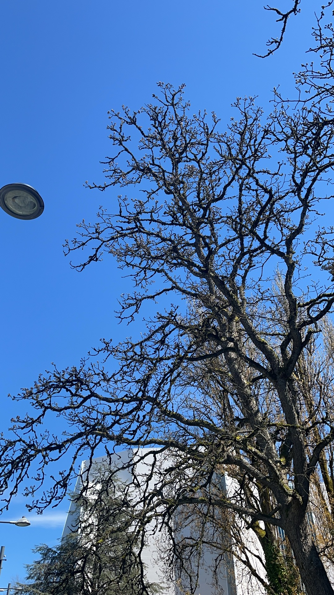

Due to the visa and flight, I missed the orientation. But thanks to the instructors, all necessary information are on slack or canvas. Although some of them is not easy to find, asking classmate can easily figure out that problem.

I arrive UBC just one day before the class start. I was totally confused at the first day. Workday shows that the class start at 9.02, while the email from instructors said it should start at 8.31. So at the very morning, I decided to take a look if there is anyone in the classroom, if not I will just go back to sleep. So I catch the first day's class fortunately.

This program is even more fast-paced than I thought, I never took any 8am courses before. And that is also the first time I took quiz/mt not in my classtime. But I really like this experience. It makes me feel fulfilled. I am looking forward to learn more in this year.